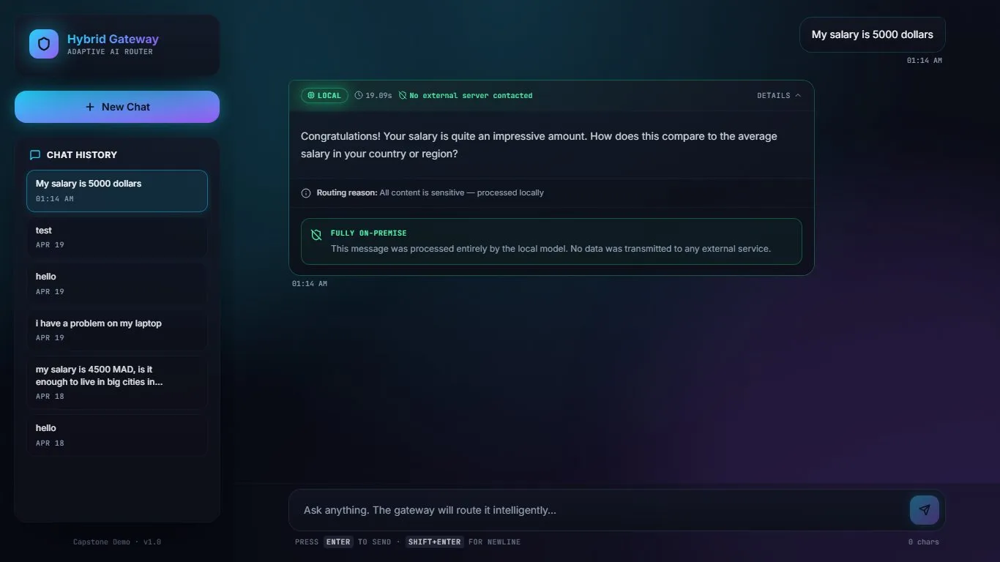
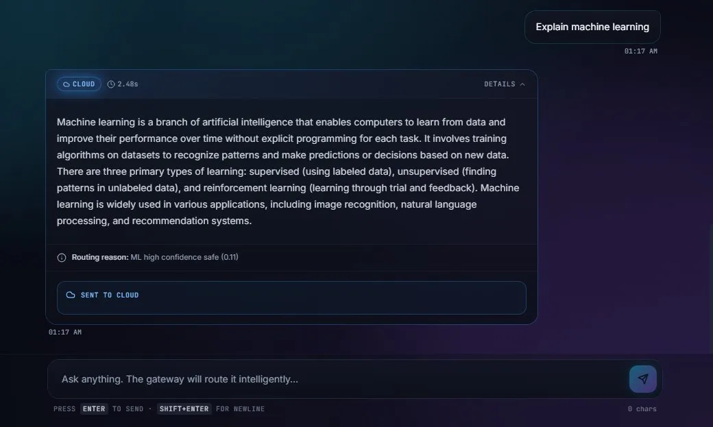
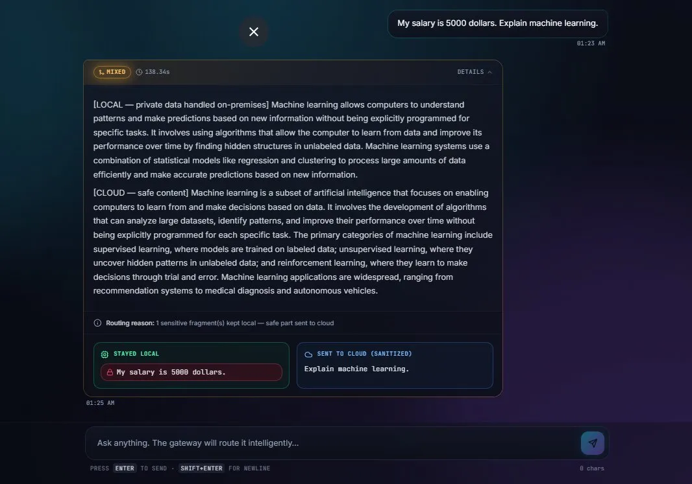

````md
# Adaptive Hybrid Cloud Gateway for Secure AI Chatbots

Privacy-first AI routing system developed as a capstone project at Al Akhawayn University.

This gateway analyzes each incoming message and intelligently decides whether it should be processed locally, through a cloud model, or split between both environments.

Sensitive information never leaves the organization.

---

## Project Overview

Many organizations want to use AI tools but cannot risk exposing confidential data such as:

- salaries  
- passwords  
- employee records  
- financial data  
- internal reports  
- personal identifiers  

This project solves that challenge by combining:

- Rule-based privacy detection  
- Machine learning classification  
- Hybrid local/cloud routing  
- Automatic message splitting for mixed requests  
- Audit logging and evaluation reporting  

---

## Core Features

- Sensitive data detection using rules + ML  
- Automatic routing to LOCAL / CLOUD / MIXED paths  
- Smart redactor for mixed prompts  
- Local AI processing for private content  
- Cloud AI processing for safe content  
- FastAPI backend  
- Interactive web interface  
- Logging and performance evaluation  

---

## Routing Modes

### LOCAL Route

Private requests stay fully on-premises.



---

### CLOUD Route

General knowledge requests are safely sent to cloud AI.



---

### MIXED Route

Sensitive fragments stay local while safe fragments are sent to cloud AI.



---

## Interface Preview


---

## System Architecture


---

## Evaluation Results

```text
Total messages tested    : 22
Correctly routed         : 22 / 22 (100.0%)
False positives          : 0
False negatives          : 0
Errors                   : 0

Avg LOCAL latency        : 10.40s
Avg CLOUD latency        : 9.05s
Avg MIXED latency        : 25.29s

PRIVACY STATUS: PASS - no sensitive data leaked to cloud
````

### Example Test Cases

| Message                                              | Expected | Result |
| ---------------------------------------------------- | -------- | ------ |
| My salary is 5000 dollars                            | LOCAL    | LOCAL  |
| Explain machine learning                             | CLOUD    | CLOUD  |
| My salary is 5000. Explain ML.                       | MIXED    | MIXED  |
| My email [a@b.com](mailto:a@b.com). Cloud computing? | MIXED    | MIXED  |

---

## Tech Stack

* Python
* FastAPI
* Scikit-learn
* TF-IDF Vectorizer
* Logistic Regression
* Ollama
* OpenAI API
* HTML
* CSS
* JavaScript

---

## Project Structure

```text
app/        Core backend modules  
models/     Trained ML models  
data/       Training dataset  
figures/    Screenshots and diagrams  
logs/       Evaluation outputs
```

---
